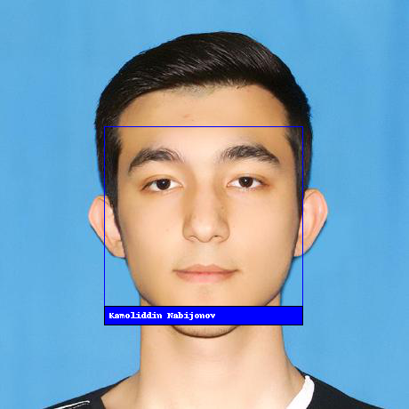

# FaceDetection

Python app that given input images, uses https://github.com/ageitgey/face_recognition to recognize faces.

# To Do:
Make GUI for uploading images, function buttons and camera support.

### Dependencies

```
brew install cmake
pip3 install face_recognition
python3 -m pip install --upgrade Pillow
```

### Instructions

```
1) upload images to img/known folder for our model to train face_recognition algorithm
2) upload images to img/unknown folder on which we have to find faces, model trained on
3) run the program and get images from img/unknown folder with highlighted by blue rectangle, faces and names below
```

You need one photo of any face to train the model so it can later detect the same one on other given images. Insert an image of face you want to detect into img/known and other images on which you want to detect faces into unknown folder. \
Using provided images, program will train on single given image and detect the same face on any other given image. \
\



